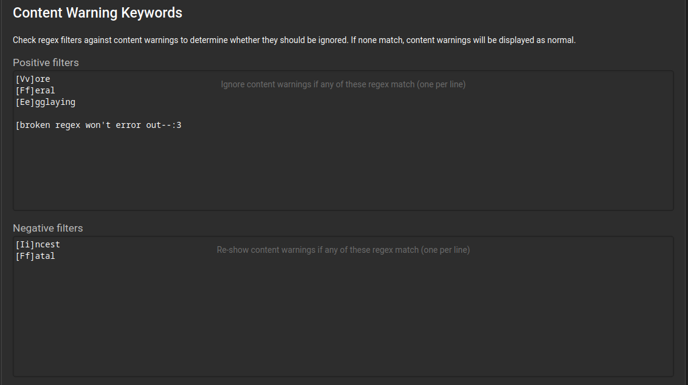
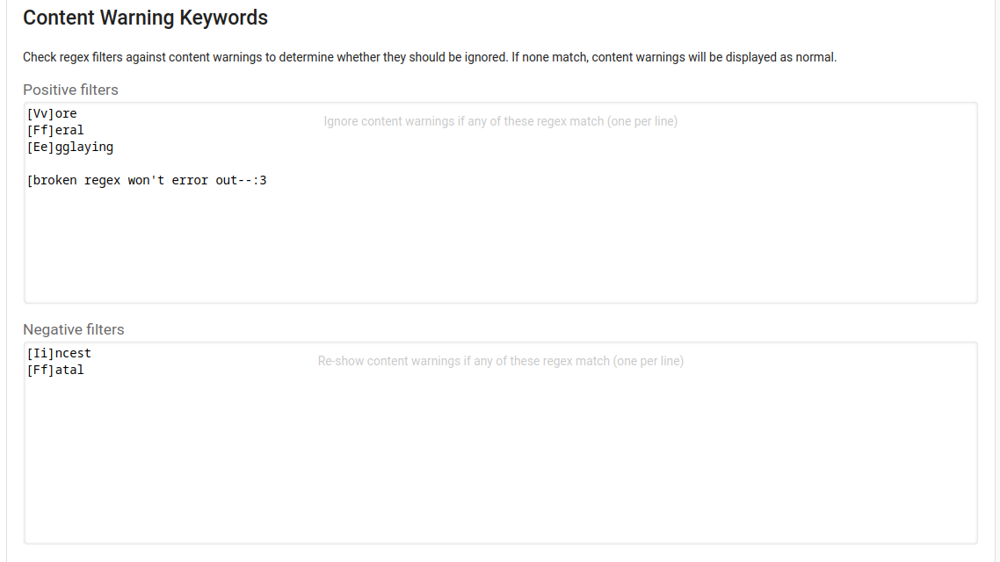

# Itaku Enhancement Suite

*The Itaku Enhancement Suite is not affiliated with the site Itaku.ee. It is developed entirely independently and with no input from site developers, owners, or moderators.*

The Itaku Enhancement Suite looks to fix a small number of usability issues on Itaku.ee without significantly altering the site's style or functionality. The extension does not look to implement broad changes.

A good way to think of the Itaku Enhancement Suite is as a set of **polyfills** for Itaku.ee. The supported features are all features that I or other people would like to see built into the site natively. Experimenting with new features via an opt-in, independent browser extension allows better understanding of which features and UX designs work well and which have unintended side-effects or require additional iteration. Ideally, features in the Itaku Enhancement Suite should dwindle over time as the site matures.

## Currently Supported Features

### Regex/keyword Content Warning Toggles

Define **positive** and **negative** filters for content warnings. Content warnings will be shown by default unless they match a positive filter, in which case they will be hidden. Hidden content warnings are also checked against negative filters, in which case they will be re-shown. For example:

A positive filter ``[Vv]ore`` and a negative filter ``[Ff]atal`` will remove a content warning such as "Safe vore", but will not remove a content warning for "Vore, fatal". Broken/malformed regex filters and blank lines will be ignored.

I've attempted to locate as many different parts of the site as possible where this is applicable:

- Home page feeds
- Image galleries
- Recently starred images
- Images within posts

Keywords are set in the "Blocking & blacklist" tab of your account settings. Both light and dark themes are supported. I've attempted to make the settings screenreader friendly, but there are likely some improvements that could be made around accessibility.

### Expanded notifications

Basic (and I mean basic) support for fetching and showing image/post/comment titles and content when looking at the notifications drawer. These currently replace the date field, but I have plans to make the UI better in the future.

Behind the scenes, this feature uses an intelligent cache that's shared between all of your Itaku.ee tabs so that
data isn't fetched unnecessarily. The cache is stored inside of the browser session storage, which will be discarded whenever you close your browser. This helps avoid data leaks.

## Current Fixes

### Click-to-show content warnings on posts

Post content warnings on Itaku tell the user to click to show the post, but the actual text isn't clickable. This change fixes the CSS so when you click on the text, the post actually opens.

### Right-click link support for profile image

Itaku's user menu is only operatable using left-click to open. This changes wraps the profile image so right-clicking will
show the user profile link and give you the option to "open link in new tab".

## Future Planned Features

### Notification Context Improvements

Continue iterating on the UI for expanded notifications:

- Move descriptions/titles out of date field.
- Show loading indicators while fetching data.

### Collapse reshares

Currently you can hide reshares entirely, or you can have each reshare show up
separately on your feed. You should be able to keep reshares on so you can still
find new artists/pieces, but toggle a setting to see only one reshare per
image/post in your feed so that the same popular image doesn't clutter up the
feed.

### Tag-based Content Warnings

The ability to define content warnings based on post/image tags. This would be strictly superior to using regex filters,  but will be a much more complicated feature because tags are not attached to feed posts by default and will need to be separately queried or filtered in some way. It's possible that hijacking the ``blacklisted`` property might help with this, but doing so would require making changes to the user's account, which is not ideal.

### Enhanced Content Blocking

Itaku's current content blocking strategy is fairly inconsistent about when posts get hidden and when posts just get warnings applied. Extending the CW feature to work with tags would open up UX space to have more predictable behaviors:

- Content blocks should "bubble" for embedded images. In other words, if you have the ``vore`` keyword blocked and a post contains an image contains that tag, posts that it is embedded inside should be completely hidden from searches/feeds. It shouldn't just be the image that has a content warning.

- Content blocks should be definable using multiple tags. For example, you should
be able to block images that have ``vore`` and ``feral`` tags together without
blocking the individual tags.

- NSFW ratings should be combinable with tag blocks. You should be able to block
a ``yoshi`` tag from NSFW images without blocking it from SFW images.

### Comic View

Itaku's default image viewer loads the XL version of the currently selected image. This is large enough that in most cases text would be easily readable. However, the image is sized down in the HTML/CSS so that comics with text are cumbersome to read. Depending on how complicated the page HTML is, it might be possible to make a better "comic view" for longform comic reading without making any additional requests to the server at all.

## Design

Being a good citizen and avoiding infrastructure abuse is important. The Itaku Enhancement Suite is highly focused on reducing backend server load on the Itaku.ee servers. There are three ways that I approach this goal:

- Minimizing extra requests to the server when fetching information. If the extension can use one request to get two pieces of information, I prefer doing that. If a request can be put off until a user action happens, I prefer doing that.

- Caching information locally when possible. If a request is going to be used in multiple places, I try to store the data locally so it can be avoided in the future.

- Designing UX to minimize the number of actions/requests that a user needs to do to accomplish a task. This is much a much more subjective category, but as an example, grouping or annotating comments/stars in the notification area may have a side effect of getting the user to open fewer tabs when checking their notifications, since they can open one tab per-piece rather than one tab per-notification.

## Privacy (policy)

I do not willingly collect any user information, annonymized or not. No information is transmitted from the Itaku Enhancement Suite to any server I control. The extension currently collects the following information and stores it locally within your browser (it is never transmitted off-device):

- Your positive and negative CW filters (user setting, stored in the extension itself)
- The currently logged in username (temporary cache, stored in sessionStorage and automatically cleared by Firefox after every browsing session)
- User-created post/image/comment descriptions/titles (temporary cache, stored in sessionStorage and automatically cleared by Firefox after every browsing session)

This list is subject to change as more features are added.

## Privacy (design)

The best way to make a software secure is to limit what it does. In other words, you don't need to secure an interface that doesn't exist.

 - Limit requested permissions. The Itaku Enhancement Suite should only ever be active on Itaku.ee. It should have no other access to browsing data. Use ``persistent: false`` for background scripts. Etc...

 - **Never** make web requests to sites other than Itaku.ee. This includes requests for fonts or browser assets. If 3rd-party requests ever become necessary in the future (ie for caching tag lists), those sources should be carefully audited and the features that rely on them should be optional.
 
 - As much as possible, avoid storing unnecessary user data even clientside. At the moment, the Itaku Enhancement Suite only stores user preferences (CW filter regexes) and no other data.
 
 - If at all possible, do not use account information or request account information at all. The Itaku Enhancement Suite should **never** request user passwords or login information. There is simply no need to access that kind of data in the first place.
 
 - **Never** log user activity even in anonymized form. Anonymization techniques for data collection are extremely dangerous and often fail in unexpected ways. For an extension of this size, there is no need to have user analytics at all, even locally. The extension is also not complicated enough to warrant adding debug logs that could leak user activity/actions, even locally.

Browser extensions are placed in a privileged position within your browser. Be careful about what you install. If you are technically inclined, I highly recommend taking a quick look at the source code to the Itaku Enhancement Suite. I've gone out of my way to make it easy to understand.

## FAQ

### Who are you?

I go by Foxyoreos online. :3

### I have a feature idea

It's better if you contact me on Itaku.ee directly. I'm more likely to see messages there, and I'd like ideas/issues to primarily come from site users. I also will not accept patches/issues/feature-requests from anypony who is under 18 years old.

### Why is this only released for Firefox?

Because the icon is cute :3 Also because building extensions for Chrome is fckn annoying and I don't want to make a Google account >:3

Why are **you** using Chrome? Why aren't you using the cute fox browser? >w<

### Is there any way to support the extension?

You can donate to Itaku's Patreon [here](https://www.patreon.com/itaku). This should be the first place where your support should go. It'll be better for everypony including me if Itaku is sustainable <3

But if you're uncomfortable linking your real-world purrsonal info on Patreon to your furry side, consider donating instead to the [EFF](https://www.eff.org/pages/donate-eff), the [Internet Archive](https://archive.org/donate/), or to the [Trevor Project](https://give.thetrevorproject.org/give/259439).
